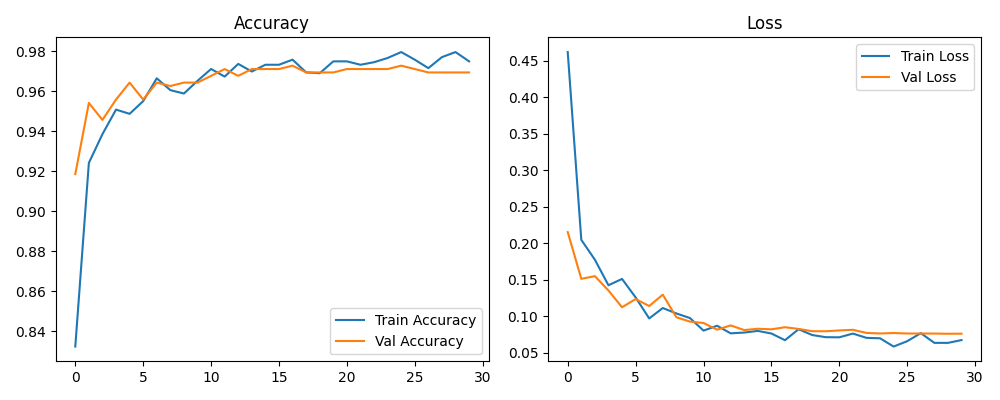
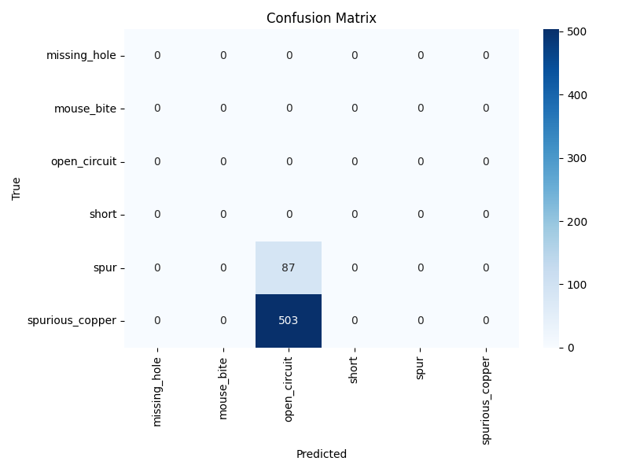
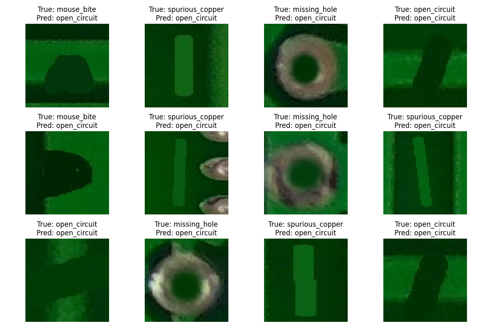

# 📘 Milestone 2: Model Training & Evaluation

**Phase:** Milestone 2  
**Focus:** Deep Learning & Classification  
**Architecture:** EfficientNetB0 (Transfer Learning)  
**Achieved Validation Accuracy:** ~97%  

---

## 📖 Milestone Overview

In this milestone, I trained and evaluated a **deep learning model** to classify PCB defects using the labeled dataset prepared in **Milestone 1**.

The goal was to build a **robust CNN-based classifier** capable of distinguishing visually similar PCB defects using transfer learning and proper regularization.

---

## 🧠 Defect Classes

The model classifies PCB images into **6 defect categories**:

- Missing Hole  
- Mouse Bite  
- Open Circuit  
- Short  
- Spur  
- Spurious Copper  

---

## 📂 Folder Structure

```
Milestone2/
│
├── src/
│ ├── train_model.py # Model training logic
│ ├── evaluate_model.py # Evaluation & metrics
│ └── inference.py # Visual inference on test images
│
├── output/
│ ├── pcb_defect_model.keras
│ ├── confusion_matrix.png
│ ├── train_val_acc_n_train_val_loss.png
│ └── Annotated_Test_Images/
│ └── Inference_Grid.png
│
├── requirements.txt
└── README.md
```

---

## ⚙️ Model Architecture

- **Backbone:** EfficientNetB0 (ImageNet pretrained, frozen)
- **Custom Head:**
  - Global Average Pooling
  - Dense (256 units, ReLU)
  - Dropout (0.3)
  - Output Dense (6 classes, Softmax)

This architecture improves separation between visually similar defects such as **Short** and **Open Circuit**.

---

## 🏋️ Model Training

- **Input Size:** 128 × 128  
- **Loss Function:** Sparse Categorical Crossentropy  
- **Optimizer:** Adam  
- **Callbacks Used:**
  - EarlyStopping
  - ReduceLROnPlateau

Training was performed on Google Colab with GPU acceleration.

📦 Trained model saved as:
output/pcb_defect_model.keras

yaml
Copy code

---

## 📊 Evaluation Results

### 📈 Training Curves
The following plot shows training vs validation accuracy and loss:



---

### 🔢 Confusion Matrix
Model performance across all defect classes:



---

## 🖼️ Inference Results

The model was tested on unseen PCB images and predictions were visualized:



---

## 🚀 How to Run

```bash
pip install -r requirements.txt
python src/train_model.py
python src/evaluate_model.py
python src/inference.py
```

✅ Milestone 2 Status
✔ Model trained successfully
✔ Evaluation metrics generated
✔ Visual proof included
✔ Outputs committed to repository

Milestone 2 completed successfully.


